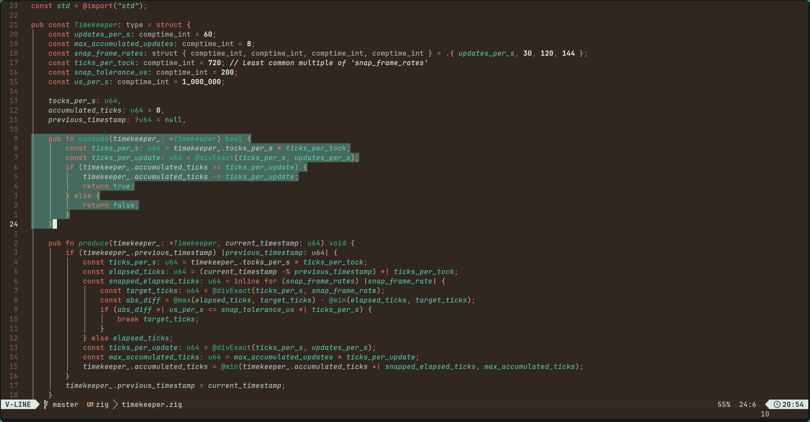
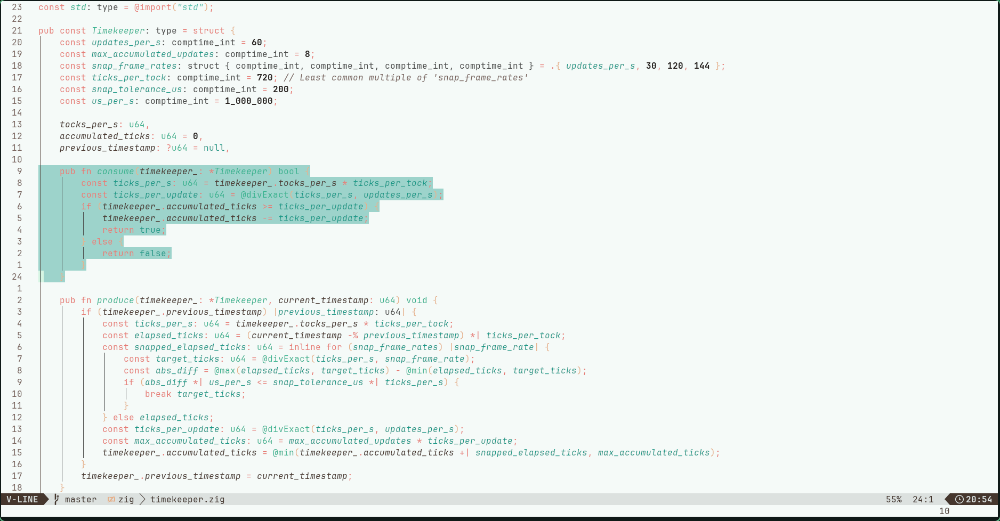

# mintchoco.nvim

`mintchoco.nvim` is a simple Neovim colorscheme. It offers a clean, visually pleasing palette with both **dark** and **light** variants, designed for comfortable long coding sessions while keeping syntax colors distinct and readable.

<table width="100%">
  <tr>
    <th>Dark</th>
    <th>Light</th>
  </tr>
  <tr>
    <td width="50%">
      
    </td>
    <td width="50%">
      
    </td>
  </tr>
</table>

---

## Features

- **Dark and light variants**: `mintchoco-dark` and `mintchoco-light`.
- **Readable syntax highlighting**: Carefully chosen colors for functions, keywords, strings, comments, errors, and warnings.
- **Emphasis and selection colors**: Highlights text and selections for clarity.
- **Consistent UI integration**: Colors for editor background, sidebar, floating windows, menus, borders, and line numbers.

---

## Installation

Using [lazy.nvim](https://github.com/folke/lazy.nvim):

```lua
{
  "chriso345/mintchoco.nvim",
  config = function()
    vim.cmd.colorscheme("mintchoco") -- automatically loads the dark variant
  end
}
````

You can switch to the light variant by calling:

```lua
vim.cmd.colorscheme("mintchoco-light")
```

---

## License

`mintchoco.nvim` is licensed under the MIT License. See the [LICENSE](LICENSE) file for more details.
